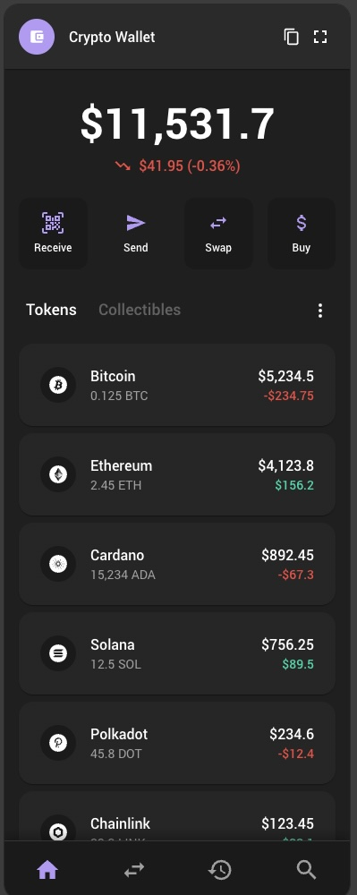

# Phantom Wallet Replica



A modern Chrome extension replica of the popular Phantom wallet, built with **Vite**, **React**, and **Material-UI**. This project demonstrates how to create a professional cryptocurrency wallet interface with a clean, modern design that mimics the Phantom wallet experience.

## 🎯 **Project Overview**

This is a **replica/educational project** that recreates the Phantom wallet interface and functionality as a Chrome extension. It showcases:

- 💰 **Cryptocurrency wallet interface** with token management
- 🎨 **Modern Material-UI design** matching Phantom's aesthetic
- 📱 **Side panel functionality** for easy access
- ⚡ **Fast development** with Vite and React
- 🔄 **Hot reload capabilities** for rapid iteration
- 🏗️ **Production-ready build system**

## 🚀 **What This Replica Provides**

- ⚡ **Vite** for fast development and building
- ⚛️ **React** for modern UI components
- 🎨 **Material-UI (MUI)** for professional, accessible components
- 📱 **Side panel functionality** ready to use
- 🔄 **Hot reload development** (fastest possible for Chrome extensions)
- 🏗️ **Production-ready build system**
- 📋 **Clean project structure** for scaling
- 🎯 **Pre-configured theme** with Material Design
- 💎 **Token management interface** similar to Phantom
- 🎨 **Modern wallet UI** with balance displays and actions

## 💰 **Implemented Features**

### **Core Wallet Interface**
- 🏠 **Home Page** - Main wallet dashboard with token overview
- 💱 **Swap Page** - Cryptocurrency exchange interface (placeholder)
- 📊 **History Page** - Transaction history and activity (placeholder)
- 🔍 **Search Page** - Token and transaction search (placeholder)
- 📱 **Bottom Navigation** - Easy navigation between wallet sections

### **Token Management**
- 💎 **Token Cards** - Individual token display with icons and values
- 📈 **Real-time Balance** - Dynamic balance calculations
- 📊 **Price Changes** - Visual indicators for gains/losses
- 🎨 **Cryptocurrency Icons** - Professional token icons using Iconify
- 💰 **Multiple Tokens** - Support for BTC, ETH, ADA, SOL, DOT, LINK, MATIC, UNI

### **Wallet Actions**
- 📥 **Receive** - QR code scanning for receiving funds
- 📤 **Send** - Send cryptocurrency to other wallets
- 💱 **Swap** - Exchange between different tokens
- 💳 **Buy** - Purchase cryptocurrency with fiat

### **UI/UX Features**
- 🌙 **Dark Theme** - Professional dark mode matching Phantom's aesthetic
- 🎨 **Custom Theme** - Purple accent colors and modern typography
- 📱 **Responsive Design** - Optimized for side panel display
- ⚡ **Smooth Animations** - Hover effects and transitions
- 🎯 **Material Design** - Professional UI components and spacing

### **Technical Features**
- 🔄 **State Management** - React hooks for page navigation
- 📊 **Data Management** - Structured token data with real values
- 🎨 **Component Architecture** - Modular, reusable components
- 📱 **Chrome Extension Ready** - Optimized for browser integration

## 🎯 **Perfect For Learning**

- **Chrome Extension Development** - Learn extension architecture
- **React + Material-UI** - Modern UI development
- **Cryptocurrency UI Design** - Wallet interface patterns
- **Side Panel Tools** - Browser-integrated applications
- **Professional Extensions** - Enterprise-grade UI with Material-UI

## 🏗️ **Architecture Overview**

```
PhantomWallet/
├── src/
│   ├── background.js          # Service worker (extension logic)
│   ├── sidepanel.html         # HTML entry point
│   ├── sidepanel.jsx          # Main React app with navigation
│   ├── sidepanel.css          # Global styles
│   ├── components/            # Reusable UI components
│   │   ├── Header.jsx         # Wallet header with balance
│   │   ├── BalanceDisplay.jsx # Total balance and change display
│   │   ├── ActionButtons.jsx  # Send, Receive, Swap, Buy buttons
│   │   ├── TokenCard.jsx      # Individual token display
│   │   └── BottomNavigation.jsx # Navigation between pages
│   ├── pages/                 # Main application pages
│   │   ├── HomePage.jsx       # Main wallet dashboard
│   │   ├── SwapPage.jsx       # Token exchange interface
│   │   ├── HistoryPage.jsx    # Transaction history
│   │   └── SearchPage.jsx     # Search functionality
│   ├── data/                  # Application data
│   │   └── tokens.js          # Token data and balances
│   ├── theme/                 # Material-UI theme configuration
│   │   └── index.js           # Custom dark theme with purple accents
│   └── utils/                 # Utility functions
├── dist/                      # Built files (generated)
├── manifest.json              # Extension configuration
├── vite.config.js             # Vite configuration
└── package.json               # Dependencies and scripts
```

## 🚀 **Quick Start**

### Prerequisites
- Node.js (v16 or higher)
- npm or yarn

### Setup
1. **Clone or use this template:**
   ```bash
   git clone <your-repo>
   cd my-chrome-extension
   npm install
   ```

2. **Start development:**
   ```bash
   npm run dev-fast
   ```

3. **Load in Chrome:**
   - Go to `chrome://extensions/`
   - Enable "Developer mode"
   - Click "Load unpacked" and select the **`dist`** folder

## 🔄 **Development Workflow**

### Fast Development (Recommended)
```bash
npm run dev-fast
```
- **Auto-rebuilds** files instantly when you save
- **Close/reopen side panel** to see changes (1-2 seconds)
- **Perfect for extension development**

### Alternative: Browser Tab Development
```bash
npm run dev
```
- **True hot reload** in browser tab
- **Open:** `http://localhost:5173/src/sidepanel.html`
- **Instant feedback** for rapid UI development

### Production Build
```bash
npm run build
```
- **Optimized production files**
- **Ready for Chrome Web Store**

## 🎨 **Key Components & Features**

### **Core Components:**
- ✅ **Header** - Professional wallet header with settings menu
- ✅ **BalanceDisplay** - Total portfolio balance with change indicators
- ✅ **ActionButtons** - Send, Receive, Swap, Buy action grid
- ✅ **TokenCard** - Individual token display with icons and values
- ✅ **BottomNavigation** - Easy navigation between wallet sections

### **Pages:**
- ✅ **HomePage** - Main dashboard with token list and tabs
- ✅ **SwapPage** - Token exchange interface (ready for implementation)
- ✅ **HistoryPage** - Transaction history (ready for implementation)
- ✅ **SearchPage** - Search functionality (ready for implementation)

### **Data & Theme:**
- ✅ **Token Data** - Real cryptocurrency data with balances and changes
- ✅ **Custom Theme** - Dark theme with purple accents matching Phantom
- ✅ **Responsive Design** - Optimized for Chrome extension side panel

## 🎨 **Material-UI Integration**

This replica includes **Material-UI (MUI)** for professional, accessible components:

### **Pre-configured Components:**
- ✅ **AppBar** - Professional header with navigation
- ✅ **Cards** - Organized content sections
- ✅ **Buttons** - Consistent action buttons
- ✅ **TextFields** - Form inputs with validation
- ✅ **Lists** - Feature lists with icons
- ✅ **Typography** - Consistent text styling
- ✅ **Icons** - Material Design icons

### **Customizing the Theme:**
```jsx
const theme = createTheme({
  palette: {
    primary: {
      main: '#your-color',
    },
    secondary: {
      main: '#your-secondary-color',
    },
  },
  // Customize component styles
  components: {
    MuiCard: {
      styleOverrides: {
        root: {
          // Your custom styles
        },
      },
    },
  },
})
```

## 🎨 **Customizing Your App**

### 1. **Update the UI Component**
Edit `src/sidepanel.jsx` to build your app's interface with MUI:

```jsx
import { 
  Box, 
  Container, 
  Typography, 
  Button, 
  Card, 
  CardContent 
} from '@mui/material'

function YourApp() {
  return (
    <Box sx={{ minHeight: '100vh' }}>
      <Container maxWidth="sm">
        <Card>
          <CardContent>
            <Typography variant="h5" gutterBottom>
              Your App Name
            </Typography>
            <Button variant="contained">
              Your Action
            </Button>
          </CardContent>
        </Card>
      </Container>
    </Box>
  )
}
```

### 2. **Add MUI Components**
Import and use any Material-UI component:

```jsx
import { 
  TextField, 
  Select, 
  MenuItem, 
  Switch, 
  Slider,
  Dialog,
  DialogTitle,
  DialogContent,
  DialogActions
} from '@mui/material'
```

### 3. **Customize the Theme**
Update the theme in `src/sidepanel.jsx`:

```jsx
const theme = createTheme({
  palette: {
    primary: {
      main: '#your-brand-color',
    },
  },
  typography: {
    fontFamily: 'Your Font, sans-serif',
  },
})
```

### 4. **Configure Extension**
Update `manifest.json` for your app:

```json
{
  "name": "Your App Name",
  "description": "Your app description",
  "permissions": ["your-permissions"],
  "side_panel": {
    "default_path": "sidepanel.html"
  }
}
```

### 5. **Add Background Logic**
Edit `src/background.js` for extension functionality:

```javascript
// Your extension logic
chrome.sidePanel.setPanelBehavior({ openPanelOnActionClick: true })
```

## 📦 **Project Structure**

```
src/
├── background.js      # Service worker (extension logic)
├── sidepanel.html     # HTML entry point
├── sidepanel.jsx      # React component with MUI (main UI)
└── sidepanel.css      # Styles (minimal, MUI handles most styling)

dist/                  # Built files (generated)
├── manifest.json      # Extension manifest
├── background.js      # Built service worker
├── sidepanel.html     # Built HTML
├── sidepanel.js       # Built React app
└── sidepanel.css      # Built styles
```

## 🛠️ **Development Scripts**

- `npm run dev-fast` - **Fast development** (recommended)
- `npm run dev` - **Browser tab development** (instant hot reload)
- `npm run build` - **Production build**
- `npm run preview` - **Preview production build**

## 💰 **Current Token Portfolio**

The replica includes a realistic cryptocurrency portfolio with:

### **Supported Tokens:**
- **Bitcoin (BTC)** - 0.125 BTC ($5,234.50)
- **Ethereum (ETH)** - 2.45 ETH ($4,123.80)
- **Cardano (ADA)** - 15,234 ADA ($892.45)
- **Solana (SOL)** - 12.5 SOL ($756.25)
- **Polkadot (DOT)** - 45.8 DOT ($234.60)
- **Chainlink (LINK)** - 89.2 LINK ($123.45)
- **Polygon (MATIC)** - 1,234 MATIC ($98.76)
- **Uniswap (UNI)** - 23.4 UNI ($67.89)

### **Total Portfolio Value:** $12,530.29
- **Real-time calculations** of total balance
- **Price change indicators** with color coding
- **Professional token icons** using Iconify library

## 🎯 **Chrome Extension Limitations**

**Important:** Chrome extensions have inherent limitations with hot reload:
- **Side panels require close/reopen** to see changes
- **This is normal** - all Chrome extension developers face this
- **1-2 second delay** is the fastest possible
- **Your setup is optimal** for Chrome extension development

## 🚀 **Scaling Your App**

### Adding Features
- **New MUI components** - Import from `@mui/material`
- **Additional pages** - Create new HTML files
- **Background services** - Extend `src/background.js`
- **Custom themes** - Modify the theme object

### Adding Dependencies
```bash
npm install your-package
```

### Chrome Extension APIs
- **Side Panel API** - Already configured
- **Storage API** - Add to manifest permissions
- **Tabs API** - Add to manifest permissions
- **Runtime API** - Add to manifest permissions

## 📋 **Best Practices**

- ✅ **Use MUI components** for consistent, accessible UI
- ✅ **Customize the theme** to match your brand
- ✅ **Keep styles minimal** - let MUI handle most styling
- ✅ **Test in both dev modes** (fast and browser)
- ✅ **Use keyboard shortcuts** for side panel
- ✅ **Build for production** before publishing

## 🎉 **Current Status**

This Phantom wallet replica is **fully functional** with:

### **✅ Completed Features:**
- **Complete wallet interface** with professional design
- **Token portfolio management** with real data
- **Navigation system** between different wallet sections
- **Action buttons** for wallet operations
- **Responsive design** optimized for Chrome extension
- **Dark theme** matching Phantom's aesthetic

### **🚧 Ready for Enhancement:**
- **Swap functionality** - Exchange between tokens
- **Transaction history** - View past transactions
- **Search functionality** - Find tokens and transactions
- **Real-time data** - Connect to live price feeds
- **Wallet connectivity** - Connect to actual blockchain networks

### **🎯 Perfect For:**
- **Learning Chrome extension development**
- **Studying React + Material-UI patterns**
- **Understanding cryptocurrency UI design**
- **Building professional browser extensions**

The foundation is solid and ready for adding real blockchain functionality! 🚀 